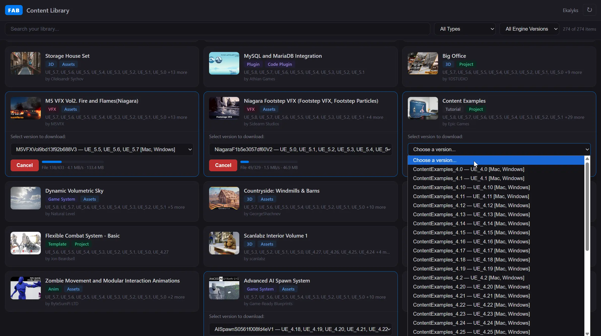

# Fab Content Downloader

> ⚠️ AI Slope
> 
> 这是个纯 Vibe 项目, 0 code review. Use at your own risk. 
> 
> 有任何疑问，让你的 Ai 看 [SPECS.md](SPECS.md)

## 它是做什么的？

有相当一部分 UE 内容是无法在 Fab 网页下载的。你需要装一个不知道哪天作妖的 Epic games launcher，装上特定版本的引擎，创建一个特定版本的项目，仅仅为了下载一个资产包。也许 Epic 觉得我们都是傻子，不知道该下哪个版本。

Anyway，把这个插件装到你的 chrome，你可以浏览所有 Fab 库中的内容并选择任意版本下载到本地。

## 安装

~~从 chrome 应用商店安装~~（我还没做）

## 安装 (Dev)

1. Open `chrome://extensions/` in Chrome
2. Enable **Developer mode** (top right)
3. Click **Load unpacked** → select the extension folder
4. Pin the extension icon to your toolbar

## 使用

* 首先你需要在 Fab 官网登录

* 接着，点击插件 → **Login with Epic Games**，插件会借用你在Fab上的 credential 

* 登录后，你可以随时点击插件 → **Open Library**

* Library 页面显示你所有的 Fab 内容

* 下载时，需要同意插件写入到你选择的本地路径

* 下载后的资产是一个 `.tar` 文件，请自行解压

## Q&A

* 为什么需要同意插件操控我的本地文件夹?
  
  * 因为从 Epic CDN 下载 GB 级的文件时，需要有个地方存放 chunks 。插件会在下载完成后把 chunks 组装成你要的资产。

* 为什么下载结果是 `.tar`，不是完好的文件夹？
  
  * 因为 Chrome 禁止我们创建 `.dll` 等可能有害的文件，而这在 UE 插件里到处都是。所以我们干脆把 chunks 弄成一整个文件，他看上去就无害了。

## Requirements

- Chrome 95+ (DecompressionStream, File System Access API)

## License

GPL-3.0

